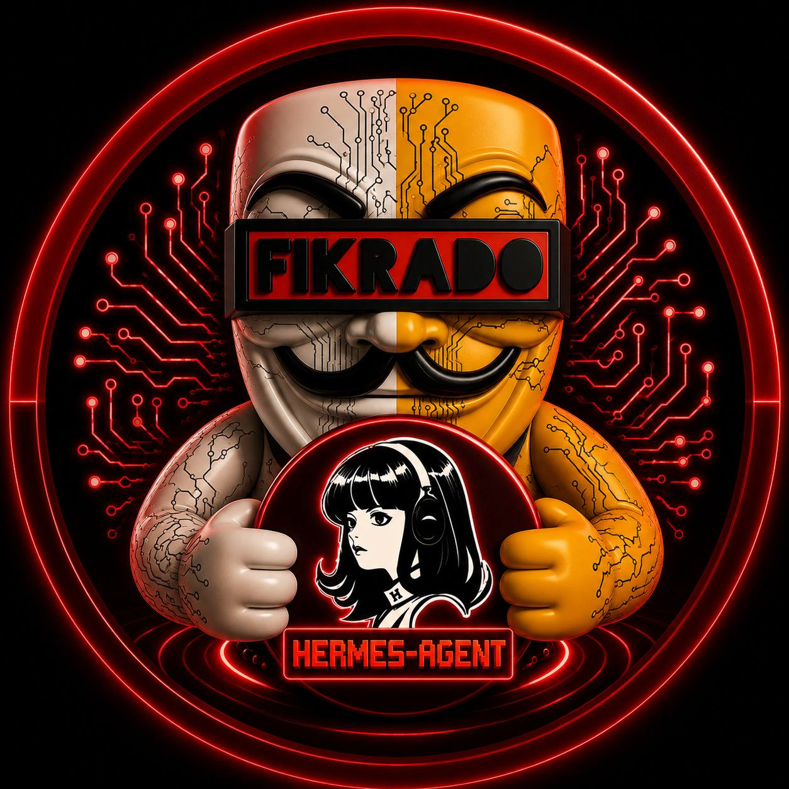

Here is a clean, professional, and highly readable `README.md` file tailored for your GitHub repository. It highlights the features, requirements, and usage of your auto-setup script.

```markdown
<p align="center">
  
</p>

<h1 align="center">Hermes AI + Ollama Auto-Setup</h1>

<p align="center">
  <strong>An automated, zero-configuration deployment script for uncensored local AI by Fikrado Security Labs.</strong>
</p>

---

## 🚀 Overview

The **Hermes AI + Ollama Auto-Setup** script is a complete, one-click solution to install, configure, and connect the [Hermes AI Agent](https://github.com/NousResearch/Hermes) with [Ollama](https://ollama.com/) on Debian/Ubuntu systems. 

It specifically targets and downloads a fully uncensored model (`dolphin-llama3:8b` by Eric Hartford), configures your shell environment, bypasses API keys, and ensures your AI runs **100% locally with absolute privacy**.

## ✨ Key Features

* **Zero API Keys required:** Everything runs on your local hardware.
* **Fully Uncensored AI:** Defaults to `dolphin-llama3:8b` (with a fallback to `dolphin-phi` for lower-spec machines), complete with an automated censorship bypass test.
* **Automated System Tuning:** Sets up systemd overrides, configures API endpoints, and binds Hermes to your local Ollama instance.
* **Smart Shell Integration:** Automatically detects and updates `.bashrc`, `.zshrc`, or `config.fish`.
* **Helper Scripts Included:** Auto-generates quick-start and management scripts in your `~/.hermes/` directory.

---

## 📋 Prerequisites

Before running the script, ensure your system meets the following minimum requirements:

* **OS:** Debian or Ubuntu-based distribution
* **Memory (RAM):** 4 GB Minimum (5 GB+ recommended for `8b` models)
* **Storage:** At least 10 GB of free disk space
* **Privileges:** `sudo` access (to install dependencies and systemd services)

---

## ⚙️ Installation & Usage

1. **Clone the repository:**
   ```bash
   git clone [https://github.com/yourusername/your-repo-name.git](https://github.com/yourusername/your-repo-name.git)
   cd your-repo-name

```

2. **Make the script executable:**
```bash
chmod +x setup.sh

```


3. **Run the installer:**
```bash
./setup.sh

```


4. **Reload your shell:**
Once the setup is complete, reload your environment variables:
```bash
source ~/.bashrc

```


*(If you use Zsh or Fish, restart your terminal or source the respective config file).*

---

## 🛠️ Helper Scripts

During installation, the script creates a dedicated directory at `~/.hermes/` containing handy management tools:

| Script | Command | Description |
| --- | --- | --- |
| **Start Hermes** | `~/.hermes/start-hermes.sh` | Quickly launches the Hermes chat interface connected to your local model. |
| **System Status** | `~/.hermes/status.sh` | Checks Ollama service health, RAM/CPU usage, and lists installed models. |
| **Switch Model** | `~/.hermes/switch-model.sh <model>` | Safely updates all environment configs and YAML files to point to a new model. |

---

## 💻 Quick Commands

Once installed, you can interact with your AI directly from the terminal using the following commands:

**Start Hermes Chat Interface:**

```bash
hermes chat --provider custom --base-url http://localhost:11434/v1 --model dolphin-llama3:8b

```

**Talk to Ollama directly:**

```bash
ollama run dolphin-llama3:8b

```

**List downloaded local models:**

```bash
ollama list

```

---

## ⚠️ Important Disclaimer

* **Uncensored Models:** The default model used in this script (`dolphin-llama3:8b`) has had its alignment and refusal mechanisms removed. It will follow user instructions without moralizing or refusing prompts. **Please use this tool responsibly and ethically.**
* **Security:** Fikrado Security built this to ensure data privacy. No prompts, data, or system telemetry are sent to the cloud.

---
